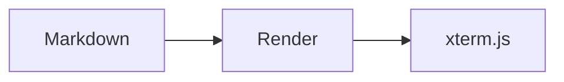

# Hello from the terminal

Welcome to a personal homepage that behaves like a small, read-only Linux shell.

> Good tools stay out of the way and make exploration feel natural.

## What lives here?

- Posts are ordinary Markdown files.
- Nested directories become nested virtual directories.
- Local and remote images can be rendered with `render`.
- Source always remains available through `cat`.

| Command | Purpose |
| --- | --- |
| `tree /blogs` | Browse the archive |
| `grep pattern file` | Search a post |
| `render file.md` | Read the rendered version |

## A code sample

```typescript
const prompt = (cwd: string) => `neko:${cwd}$ `;
console.log(prompt('/blogs'));
```

Try `cat` on this file to compare the raw Markdown with this rendered view.

## A local image

The image below is loaded from the same nested blog directory and displayed
through the iTerm2 inline image protocol.


## A formula block

MathJax renders display formulas into the terminal as internal image chunks.

$$
\sum_{k=1}^{n} k = \frac{n(n+1)}{2}
$$

This identity is rendered by MathJax.

## A Mermaid diagram

Fenced code blocks marked as `mermaid` become terminal image chunks too.



This flowchart is rendered by Mermaid.
