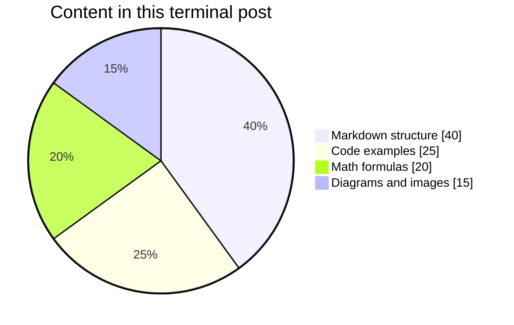
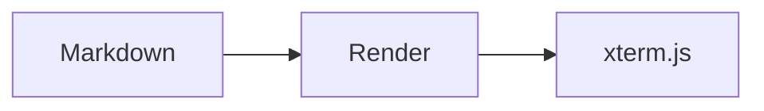

# Hello from the terminal

Welcome to a personal homepage that behaves like a small, read-only Linux shell.

> Good tools stay out of the way and make exploration feel natural.

## What lives here?

- Posts are ordinary Markdown files.
- Nested directories become nested virtual directories.
- Local and remote images can be rendered with `render`.
- Source always remains available through `cat`.

| Command | Purpose |
| --- | --- |
| `tree /post` | Browse the archive |
| `grep pattern file` | Search a post |
| `render file.md` | Read the rendered version |

## Heading levels

### Third-level heading

Third-level headings are useful for sections inside a larger topic.

#### Fourth-level heading

Fourth-level headings can introduce a focused detail without breaking the flow.

##### Fifth-level heading

Fifth-level headings work well for small implementation notes.

## List structures

### Unordered list

- Markdown files remain easy to edit.
- Terminal output stays readable without a browser layout engine.
- Rich content is rendered only when requested.

### Ordered list

1. Find an article with `tree /post`.
2. Inspect its source with `cat`.
3. Render it with `render`.

### Ordered list with nested unordered items

1. Choose the kind of content to publish.
   - Put regular articles under `content/posts/`.
   - Put project notes under `content/project/`.
   - Put standalone HTML slides under `content/slide/`.
2. Preview the content locally.
   - Use `render` for Markdown and slides.
   - Use `cat` when the original source matters.

### Multi-line ordered items

1. A numbered item may continue on another source line when the continuation
   is indented to align with the item's content.

   It may also contain a second paragraph under the same number. Every line in
   this paragraph remains indented, so Markdown keeps it attached to item one.
2. The next number begins only after the indented content is complete.

## Code samples

### TypeScript

```typescript
const prompt = (cwd: string) => `neko:${cwd}$ `;
console.log(prompt('/post'));
```

### Bash

```bash
find /post -type f -name '*.md' | sort
```

### Python

```python
from pathlib import Path

posts = sorted(Path('content/posts').rglob('*.md'))
for post in posts:
    print(post.as_posix())
```

### Go

```go
package main

import "fmt"

func main() {
    fmt.Println("neko:/post$")
}
```

### Rust

```rust
fn main() {
    let posts = ["hello-terminal.md", "zz-emoji.md"];
    for post in posts {
        println!("{post}");
    }
}
```

Try `cat` on this file to compare the raw Markdown with this rendered view.

## A local image

The image below is loaded from the same post directory and displayed
through the iTerm2 inline image protocol.


## A formula block

MathJax renders display formulas into the terminal as internal image chunks.

$$
\sum_{k=1}^{n} k = \frac{n(n+1)}{2}
$$

This identity is rendered by MathJax.

The next expression combines nested sums, logarithms, exponentials, a
temperature parameter, and L2 regularization.

$$
L(\theta)
= -\sum_{i=1}^{n}\log\left(
\frac{\exp(z_{i,y_i}/\tau)}
{\sum_{j=1}^{K}\exp(z_{i,j}/\tau)}
\right)
+ \lambda\left\|\theta\right\|_2^2
$$

This loss function is also rendered as an internal image chunk.

## A Mermaid pie chart

Mermaid supports more than flowcharts. This pie chart summarizes the kinds of
content demonstrated by this article.



This pie chart is rendered by Mermaid.

## A Mermaid diagram

Fenced code blocks marked as `mermaid` become terminal image chunks too.



This flowchart is rendered by Mermaid.

## TODO list

- [ ] Add a new post under `content/posts/`.
- [x] Render this example with MathJax and Mermaid.
